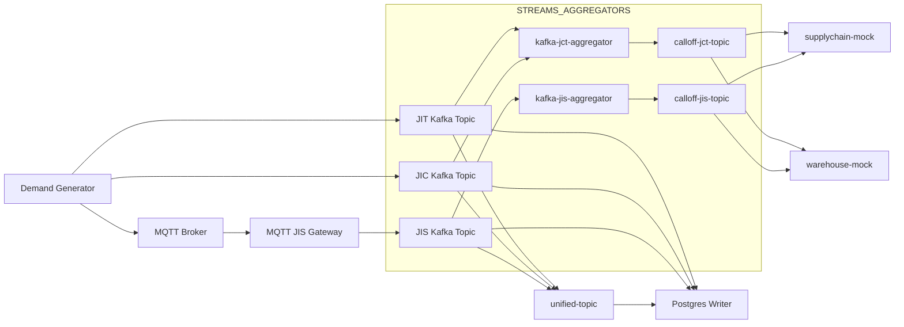

# Architecture reference

## ✅ 1. JIT (Just-In-Time) Message

**📦 Purpose:** Time-critical parts for production, delivered exactly when needed.

```json
{
  "part_number": "ABC-123",
  "location_code": "LINE-01",
  "lead_time": "2025-07-17T10:00:00Z",
  "tad": 2,
  "quantity": 15,
  "add_note": "Critical engine component"
}
```

| Field           | Type    | Description                                 |
| --------------- | ------- | ------------------------------------------- |
| `part_number`   | String  | Identifier of the part                      |
| `location_code` | String  | Target assembly line or sub-location        |
| `lead_time`     | String  | Time of Actual Delivery (ISO timestamp)     |
| `tad`           | Integer | minimum quantity to continue the production |
| `quantity`      | Integer | Required quantity                           |
| `add_note`      | String  | Optional note for logistics team            |


📌 **Kafka Topic:** `jit-topic`
 📂 **DB Table:** `jit_events`

------

## ✅ 2. JIC (Just-In-Case) Message

**📦 Purpose:** Long lead-time parts, ordered in bulk for risk mitigation or stock buffer.

```json
{
  "part_number": "DEF-456",
  "location_code": "WH-A1",
  "lead_time": "2025-07-17T10:00:00Z",
  "quantity": 100,
  "add_note": "Bulk order for seasonal demand"
}
```

| Field           | Type    | Description                             |
| --------------- | ------- | --------------------------------------- |
| `part_number`   | String  | Identifier of the part                  |
| `location_code` | String  | Stock or warehouse destination          |
| `lead_time`     | String  | Time of Actual Delivery (ISO timestamp) |
| `quantity`      | Integer | Bulk quantity                           |
| `add_note`      | String  | Optional freeform note                  |


📌 **Kafka Topic:** `jic-topic`
 📂 **DB Table:** `jic_events`

------

## ✅ 3. JIS (Just-In-Sequence) Message

**📦 Purpose:** Special sequence delivery of grouped parts (e.g., for a vehicle).

```json
{
  "part_numbers": ["XYZ-789", "XYZ-790", "XYZ-791"],
  "location_code": "LINE-02",
  "lead_time": "2025-07-17T08:30:00Z",
  "tad": 1,
  "quantity": 1,
  "line_details": {
    "vehicle_id": "VIN-2025-00123",
    "sequence_number": "SEQ-007"
  },
  "add_note": "Full bumper assembly sequence"
}
```

| Field           | Type          | Description                                 |
| --------------- | ------------- | ------------------------------------------- |
| `part_numbers`  | Array[String] | Multiple parts grouped per sequence         |
| `location_code` | String        | Target production location                  |
| `lead_time`     | String        | Time of Actual Delivery (ISO timestamp)     |
| `tad`           | Integer       | minimum quantity to continue the production |
| `quantity`      | Integer       | Typically 1, grouped per car or batch       |
| `line_details`  | Object        | Extra info: vehicle ID, sequence            |
| `add_note`      | String        | Freeform comment                            |


📌 **Kafka Topic:** `jis-topic`
 📂 **DB Table:** `jis_events`

------

## ✅ 4. Unified Call-Off Message

**📦 Purpose:** Final computed instruction for supplier after merging JIT, JIC, and JIS needs.

```json
{
  "part_number": "ABC-123",
  "location_code": "LINE-01",
  "lead_time": "2025-07-17T10:00:00Z",
  "tad": 2,
  "quantity": 15,
  "add_note": "Critical engine component",
    "demand_type" : "JIT",
    "additional_notes": "xwqsdfa"
}
```

| Field                   | Type    | Description                              |
| ----------------------- | ------- | ---------------------------------------- |
| `call_off_id`           | String  | Unique ID for tracking                   |
| `supplier_id`           | String  | Mapped supplier for that part            |
| `part_number`           | String  | Unified from JIT/JIC/JIS                 |
| `quantity`              | Integer | Consolidated quantity                    |
| `destination_location`  | String  | Target location (unified)                |
| `planned_delivery_time` | String  | Chosen/planned time based on priority    |
| `status`                | String  | Initial status: `PENDING` or `CONFIRMED` |


📌 **Kafka Topic:** `unified-topic`
 📂 **DB Table:** `call_off_event`


## ✅ 1. `jit_events` Table

```sql
CREATE TABLE IF NOT EXISTS logistics.jit_events (
    id SERIAL PRIMARY KEY,
    part_number VARCHAR(100) NOT NULL,
    location_code VARCHAR(100) NOT NULL,
    lead_time VARCHAR(50) NOT NULL,
    tad INTEGER NOT NULL,
    quantity INTEGER NOT NULL,
    add_note TEXT,
    received_at TIMESTAMP WITH TIME ZONE DEFAULT now()
);

-- Indexes
CREATE INDEX IF NOT EXISTS idx_jit_part_number ON logistics.jit_events(part_number);
CREATE INDEX IF NOT EXISTS idx_jit_tad ON logistics.jit_events(tad);
CREATE INDEX IF NOT EXISTS idx_jit_location ON logistics.jit_events(location_code);
```

------

## ✅ 2. `jic_events` Table

```sql
CREATE TABLE IF NOT EXISTS logistics.jic_events (
    id SERIAL PRIMARY KEY,
    part_number VARCHAR(100) NOT NULL,
    location_code VARCHAR(100) NOT NULL,
    lead_time VARCHAR(50) NOT NULL,
    quantity INTEGER NOT NULL,
    add_note TEXT,
    received_at TIMESTAMP WITH TIME ZONE DEFAULT now()
);

-- Indexes
CREATE INDEX IF NOT EXISTS idx_jic_part_number ON logistics.jic_events(part_number);
CREATE INDEX IF NOT EXISTS idx_jic_location ON logistics.jic_events(location_code);
```

------

## ✅ 3. `jis_events` Table

```sql
CREATE TABLE IF NOT EXISTS logistics.jit_events (
    id SERIAL PRIMARY KEY,
    part_number VARCHAR(100) NOT NULL,
    location_code VARCHAR(100) NOT NULL,
    lead_time VARCHAR(50) NOT NULL,
    tad INTEGER NOT NULL,
    quantity INTEGER NOT NULL,
    add_note TEXT,
    received_at TIMESTAMP WITH TIME ZONE DEFAULT now()
);

-- Indexes
CREATE INDEX IF NOT EXISTS idx_jit_part_number ON logistics.jit_events(part_number);
CREATE INDEX IF NOT EXISTS idx_jit_tad ON logistics.jit_events(tad);
CREATE INDEX IF NOT EXISTS idx_jit_location ON logistics.jit_events(location_code);
```

> 💡 `part_numbers` is stored as a `TEXT[]` array to accommodate multiple parts per message.

------

## ✅ 4. `call_off_event` Table

```sql
CREATE TABLE IF NOT EXISTS logistics.call_off_event (
    id SERIAL PRIMARY KEY,
    call_off_id VARCHAR(100) NOT NULL,
    part_number VARCHAR(100) NOT NULL,
    location_code VARCHAR(100) NOT NULL,
    lead_time VARCHAR(50) NOT NULL,
    tad INTEGER NOT NULL,
    quantity INTEGER NOT NULL,
    demand_type VARCHAR(20) NOT NULL,  -- JIT, JIS, JIC
    additional_notes TEXT,
    created_at TIMESTAMP WITH TIME ZONE DEFAULT now()
);


-- Indexes
-- Unique ID for deduplication
CREATE UNIQUE INDEX IF NOT EXISTS idx_calloff_calloff_id   ON logistics.call_off_event(call_off_id);
CREATE INDEX IF NOT EXISTS idx_calloff_part_number   ON logistics.call_off_event(part_number);
CREATE INDEX IF NOT EXISTS idx_calloff_location_code   ON logistics.call_off_event(location_code);
CREATE INDEX IF NOT EXISTS idx_calloff_lead_time   ON logistics.call_off_event(lead_time);
CREATE INDEX IF NOT EXISTS idx_calloff_demand_type   ON logistics.call_off_event(demand_type);
```

------

## 🧹 Additional Notes

- All tables include a `received_at` or `created_at` timestamp for event tracking.
- Schema: `logistics` is used consistently across all tables.
- Naming convention aligns with Kafka topic names for clarity.


### ✅ Plan for `postgres-writer` Enhancement

#### 🔄 Topics & Event Types to Support

| Kafka Topic     | Event Class    | Target Table               |
| --------------- | -------------- | -------------------------- |
| `jit-topic`     | `JITEvent`     | `logistics.jit_event`      |
| `jic-topic`     | `JICEvent`     | `logistics.jic_event`      |
| `jis-topic`     | `JISEvent`     | `logistics.jis_event`      |
| `unified-topic` | `CallOffEvent` | `logistics.call_off_event` |

## 🧠 Updated Event-Driven Logistics Platform: Kafka Streams Perspective

### 🧩 Component Overview



------

### 📂 Kafka Streams Projects Separation

| Project                   | Description                                                  |
| ------------------------- | ------------------------------------------------------------ |
| **kafka-jct-aggregator**  | 🧠 Aggregates `JIT` + `JIC` by `part_number`, `location_code`, `lead_time`.<br/>Evicts unjoined messages after TTL. Emits to `calloff-jct-topic`. |
| **kafka-jis-aggregator**  | 📦 Groups `JIS` messages by `part_numbers`, `location_code`, and date of `lead_time`. Time-windowed merge into `calloff-jis-topic`. |
| **kafka-unifier-streams** | 🔄 Merges `calloff-jct-topic` and `calloff-jis-topic` into `unified-topic`.<br/>This unifies into a consistent `CallOffEvent` model. |


------

### ✅ Technical Enhancements Introduced

| Topic/Area                | Enhancement                                                  |
| ------------------------- | ------------------------------------------------------------ |
| **Partitioning Strategy** | All messages use `part_number` as Kafka key → ensures same partition → supports joins |
| **CallOff Aggregation**   | `JCT Aggregator`: Aggregates JIC+JIT <br/> `JIS Aggregator`: Time-windowed sequence merge |
| **Eviction Logic**        | `JCT`: Unjoined JIT events older than 1hr are released as individual call-offs |
| **Output Topics**         | `calloff-jct-topic`, `calloff-jis-topic` → fed into `unified-topic` |
| **Postgres Writers**      | Every topic (including calloff) has its own table for audit + traceability |


------

### ✅ Data Schema Alignment Summary

| Type             | `JIT` / `JIC`            | `JIS`                                  | Call-Off (`JCT`/`JIS`)                                    |
| ---------------- | ------------------------ | -------------------------------------- | --------------------------------------------------------- |
| **Key**          | `part_number`            | `part_number[]` (flattened by unifier) | `part_number`                                             |
| **Lead Time**    | Integer (Days/Hours)     | Integer (usually 1–2)                  | Derived (Minimum or common across group)                  |
| **Location**     | `location_code`          | `location_code`                        | Unified from common origin                                |
| **Output Topic** | `jit-topic`, `jic-topic` | `jis-topic`                            | `calloff-jct-topic`, `calloff-jis-topic`, `unified-topic` |
