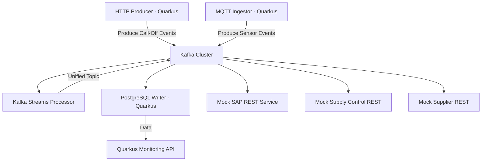

# 🚀 **Learning Project Proposal**

## 🎯 **Project Objective**

**Build a simplified Event-Driven Logistics Platform** demonstrating:
 ✅ Quarkus microservices
 ✅ Kafka messaging and Streams
 ✅ MQTT ingestion
 ✅ PostgreSQL storage
 ✅ Mock REST consumers for downstream systems

------

## 🏗️ **Architecture Overview**

Below is what the project will look like end-to-end:

------

### 🌐 **Components**

1️⃣ **Inbound Event Producer**

- Quarkus app
- Receives HTTP orders (simulates SPAB/iJIX call-offs)
- Publishes events to Kafka topics

2️⃣ **MQTT Ingestor**

- Quarkus app or a connector
- Subscribes to MQTT topic (e.g., “sensors/line-status”)
- Forwards messages into Kafka (ingesting sensor signals)

3️⃣ **Kafka Streams Processor**

- Quarkus app
- Consumes:
  - Call-off events
  - Sensor events
- Joins and enriches into a **unified topic**

4️⃣ **PostgreSQL Writer**

- Quarkus app
- Consumes unified topic
- Persists events in PostgreSQL

5️⃣ **Mock External Systems**

- REST endpoints simulating:
  - SAP system
  - Supply Control
  - Supplier EDI system
- Subscribed via Kafka consumers or invoked over REST

6️⃣ **Monitoring Dashboard**

- a simple Quarkus REST API to query PostgreSQL and display received events

------

## 📘 **Illustration: Mermaid Diagram**

------

## 🛠️ **Tech Stack**

✅ **Quarkus** for all microservices
 ✅ **Kafka** (local Docker or Confluent Platform)
 ✅ **Kafka Streams** for merging
 ✅ **Kafka Connect MQTT** or Quarkus MQTT client
 ✅ **PostgreSQL** (Docker)
 ✅ **Docker Compose** for orchestration

------

## 🎓 **Learning Goals**

**By building this project, your team will learn:**

🔹 Kafka Fundamentals

- Producing/Consuming
- Topic configuration
- Offsets & partitions

🔹 Kafka Streams

- Joins and transformations
- Windowed processing

🔹 MQTT Integration

- Bridging IoT messages into Kafka

🔹 Quarkus Development

- REST endpoints
- Reactive messaging
- Dependency injection
- Config and health checks

🔹 Event-Driven Architecture

- Decoupling producers and consumers
- Idempotency considerations
- Replay strategies

🔹 PostgreSQL persistence

- Transactional storage of events
- Simple query APIs

🔹 Mocking external consumers

- Simulate downstream systems

------

## ✅ **Planned Work Breakdown** and status

### **Phase 1 – Bootstrapping** ( infra completed)

- Setup Docker Compose with Kafka, Zookeeper, PostgreSQL

### **Phase 2 – MQTT Ingestor**

- Subscribe to an MQTT topic (`sensors/#`)
- Produce to `sensor-topic`

### **Phase 3 – Inbound Producer**

- REST endpoint to receive `call-off` JSON
- Produce to `call-off-topic`

### **Phase 4 – Streams Processor**

- Merge `call-off-topic` + `sensor-topic`
- Enrich data and publish to `unified-topic`

### **Phase 5 – PostgreSQL Writer**

- capture sensor-topic and call-off-topic data and post into data base for persistence. this is extended listener to capture all data in DB. not the main logic. ( This section is development completed for basic purpose)
- Consume `unified-topic`
- Write to a `logistics_events` table

### **Phase 6 – Mock External Services**

- Create Quarkus apps exposing:
  - `/sap-receiver`
  - `/supply-control`
  - `/supplier-edi`
- Consume Kafka events or receive HTTP calls

### **Phase 7 – Monitoring API**

- REST endpoint to fetch persisted events

------

## 📈 **Optional Enhancements**

- Use Kafka Connect for PostgreSQL sink
- Integrate Avro schemas and Schema Registry
- Add Prometheus/Grafana for metrics
- Implement Quarkus Dev Services for Kafka auto-provisioning
- Containerize everything for smooth demos

------

## 📝 **Why This Works So Well**

✅ Mirrors industry **real architecture**:

- Event-driven
- Kafka-centric
- Streams transformations
- REST + MQTT ingress

✅ Teaches everything in a **safe, testable environment**

✅ Makes a great **portfolio project** and proof of capability for client discussions