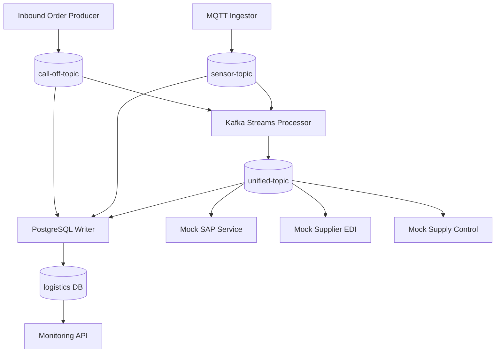

# 📘 **Application Requirements Document**

------

## 🎯 **Project Name**

**Event-Driven Logistics Platform**

------

## 🟢 **Objective**

This project demonstrates how a modern manufacturing company (**Bauto**) can:

- Ingest production and sensor events
- Process and enrich data streams in real time
- Persist events for auditing and reporting
- Integrate with external systems using decoupled consumers

It serves as a **learning platform** to teach developers:

- Event-driven architecture concepts
- Kafka and Kafka Streams
- MQTT ingestion
- Microservices with Quarkus
- PostgreSQL persistence
- Monitoring with Prometheus

------

## 🛠️ **High-Level Functional Overview**

The platform consists of **seven core components**:

------

### 🔹 1️⃣ Inbound Order Producer

- A microservice exposes an HTTP REST API to receive *material call-off* orders.
- Each received order is published to Kafka (`call-off-topic`) in JSON format.

------

### 🔹 2️⃣ MQTT Ingestor

- A microservice subscribes to an MQTT broker (`sensors/#`) to collect real-time production or environmental sensor data.
- Each incoming MQTT message is published to Kafka (`sensor-topic`).

------

### 🔹 3️⃣ Kafka Streams Processor

- This service consumes both `call-off-topic` and `sensor-topic`.
- It performs:
  - Event enrichment
  - Transformation
  - Joining records into a unified event
- It publishes the enriched records to `unified-topic`.

------

### 🔹 4️⃣ PostgreSQL Writer

- Capture sensor-topic and call-off-topic data and post into data base for persistence. this is extended listener to capture all data in DB. not the main logic. ( This section is development completed for basic purpose)
- This service subscribes to `unified-topic`.
- It persists all events into a PostgreSQL database table (`logistics_events`) for traceability and reporting.

------

### 🔹 5️⃣ Mock SAP Integration Service

- A microservice simulates an external SAP system.
- It subscribes to relevant Kafka topics or exposes REST endpoints to receive event notifications.

------

### 🔹 6️⃣ Mock Supply Control Service

- A simulated external service that represents a supply control system.
- It receives events either via Kafka consumer or REST endpoint.

------

### 🔹 7️⃣ Mock Supplier EDI Service

- A dummy REST service to emulate an EDI integration with suppliers.
- Optionally subscribes to Kafka topics for automated order updates.

------

### 🔹 8️⃣ Monitoring API

- A microservice exposes REST APIs to:
  - Query persisted events in PostgreSQL.
  - Return metrics (Micrometer Prometheus format) for observability.

------

## 🟢 **Key Use Cases**

**Use Case 1: Ingest Call-Off Orders**

- An operator or automated system posts JSON payloads to the HTTP API.
- The producer service forwards these events to Kafka.

------

**Use Case 2: Stream Sensor Data**

- The MQTT broker streams sensor messages.
- The MQTT ingestor picks them up and produces Kafka events.

------

**Use Case 3: Merge and Enrich Data Streams**

- The Kafka Streams processor:
  - Joins call-off events with sensor data.
  - Creates a unified enriched event.

------

**Use Case 4: Persist and Audit**

- The PostgreSQL writer persists all unified events for compliance and auditing.

------

**Use Case 5: Integrate with External Systems**

- Mock SAP, Supply Control, and Supplier EDI services consume relevant events.
- These simulate real integrations with external platforms.

------

**Use Case 6: Monitoring and Metrics**

- Developers and operators can:
  - Query persisted data.
  - View Prometheus metrics via Micrometer.

------


**platform architecture** should demonstrate:




## 🟢 **Non-Functional Requirements**

| Requirement       | Details                                         |
| ----------------- | ----------------------------------------------- |
| **Performance**   | Handle ~50–100 events/sec for simulation        |
| **Resilience**    | Kafka-based recovery and replay support         |
| **Observability** | All services expose `/q/metrics` for Prometheus |
| **Scalability**   | Services can scale independently                |
| **Simplicity**    | No security/authentication initially            |
| **Portability**   | Runs via Docker Compose and optionally Minikube |


------

## 🟢 **Data Flow Summary**

1️⃣ REST call-off orders → Kafka `call-off-topic`
 2️⃣ MQTT sensor data → Kafka `sensor-topic`
 3️⃣ Kafka Streams merge → `unified-topic`
 4️⃣ PostgreSQL Writer persists events
 5️⃣ Mock services consume events
 6️⃣ Monitoring API provides event queries and metrics

------

## 🟢 **Event Formats**

✅ All messages exchanged will use **JSON**.

Example Call-Off Event:

```json
{
  "call_off_id": "CO123456",
  "supplier_id": "SUP789",
  "part_number": "PN-001-A",
  "quantity": 500,
  "destination_location": "WH-ZONE-3",
  "planned_delivery_time": "2025-07-16T15:30:00Z",
  "status": "SCHEDULED"
}
```

Example Sensor Event:

```json
{"sensorId":"abc124","partNumber":"PN-01","location":"ZONE-A","temperature":72.5,"humidity":55.0,"timestamp":"2025-07-17T13:00:00"}
```

Example Unified Event:

```structured text
yet to design on how to unify the sensor data and call-off event data.
```

------

## 🟢 **Dependencies**

✅ Docker Compose for:

- Kafka
- Zookeeper
- MQTT
- PostgreSQL

✅ GraalVM JDK 17 for Quarkus apps

✅ Prometheus-compatible metrics endpoint (`/q/metrics`) in every service

------

## 🟢 **Scope Exclusions**

- No production-grade security (SSL/TLS, ACLs)
- No Avro/Protobuf schemas
- No external authentication

------

## 🟢 **Project Outcomes**

✅ Developers will learn:

- Kafka Producer/Consumer development
- Kafka Streams transformations
- MQTT ingestion flows
- Event persistence patterns
- Microservice observability

✅ This project will serve as:

- A reference architecture
- A training lab
- A demonstration platform for event-driven supply chain flows

------

✅ **End of Document**