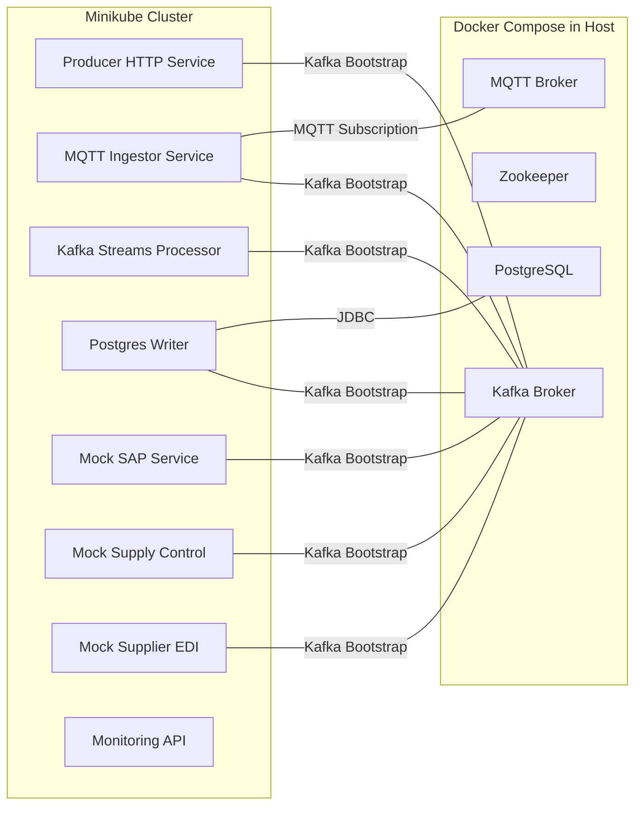

# 📘 **Tech Stack Decision Document**

## 🎯 **Project Name**

**Event-Driven Logistics Learning Platform**

------

## 🟢 **Objective**

Build an end-to-end event-driven microservices platform demonstrating:

- Kafka event ingestion and processing
- MQTT integration
- Real-time stream transformations
- PostgreSQL persistence
- Decoupled consumers
- Quarkus microservices with GraalVM JVM

This environment will serve as a hands-on learning lab for developers to master:

- Kafka fundamentals
- Kafka Streams
- MQTT bridging
- Quarkus development
- Event-driven architecture principles

------

## 🛠️ **Core Technology Stack**

| **Component**    | **Version / Image**              | **Notes**                        |
| ---------------- | -------------------------------- | -------------------------------- |
| Kafka            | bitnami/kafka:3.4                | Docker Compose                   |
| Zookeeper        | bitnami/zookeeper:3.6.2          | Docker Compose                   |
| MQTT             | eclipse-mosquitto:2.0            | Lightweight MQTT broker          |
| PostgreSQL       | 15                               | Docker Compose                   |
| Java             | GraalVM JDK 17                   | JVM Mode                         |
| Quarkus          | Latest 3.x                       | Micrometer metrics enabled       |
| Docker           | 27.5.1                           | Host installation                |
| Minikube         | v1.36.0                          | Optional Kubernetes testing      |
| Monitoring       | Micrometer + Prometheus scraping | Lightweight, standard in Quarkus |
| Messaging Format | JSON                             | Simple to start                  |

### **1️⃣ Messaging and Streaming Backbone**

| Component | Choice                                                       |
| --------- | ------------------------------------------------------------ |
| Kafka     | `bitnami/kafka:3.4`                                          |
| Zookeeper | `bitnami/zookeeper:3.6.2`                                    |
| Rationale | Lightweight images, easy Docker Compose setup, modern Kafka version compatible with Kafka Streams and Quarkus clients |

------

### **2️⃣ MQTT Broker**

| Component | Choice                                                       |
| --------- | ------------------------------------------------------------ |
| MQTT      | `eclipse-mosquitto:2.0`                                      |
| Rationale | Simple and lightweight broker for ingesting IoT/sensor-style messages |

------

### **3️⃣ Microservices Framework**

| Component | Choice                                                       |
| --------- | ------------------------------------------------------------ |
| Framework | Quarkus 3.x                                                  |
| Java      | GraalVM JDK 17 (JVM mode)                                    |
| Rationale | Fast startup, modern APIs, built-in support for Kafka and Micrometer metrics |

------

### **4️⃣ Data Persistence**

| Component  | Choice                                                       |
| ---------- | ------------------------------------------------------------ |
| Database   | PostgreSQL 15                                                |
| Deployment | Docker Compose (not Kubernetes)                              |
| Rationale  | Simpler local persistence, mature relational store, widely used in event sourcing |

------

### **5️⃣ Container Orchestration and Local Environment**

| Component | Choice                                                       |
| --------- | ------------------------------------------------------------ |
| Docker    | 27.5.1                                                       |
| Minikube  | v1.36.0 (optional)                                           |
| Rationale | Docker Compose for local dev, Minikube available for Kubernetes experiments |

------

### **6️⃣ Monitoring and Observability**

| Component          | Choice                                                       |
| ------------------ | ------------------------------------------------------------ |
| Metrics Collection | Micrometer in Quarkus                                        |
| Export Format      | Prometheus-compatible metrics                                |
| Rationale          | No additional sidecars needed; consistent lightweight approach across services |

------

### **7️⃣ Event Format**

| Component      | Choice                                                     |
| -------------- | ---------------------------------------------------------- |
| Message Format | JSON                                                       |
| Rationale      | Simple, language-agnostic, avoids need for schema registry |

------

### **8️⃣ Security**

| Aspect         | Decision                                          |
| -------------- | ------------------------------------------------- |
| Kafka Security | No authentication or TLS                          |
| API Security   | No authentication required                        |
| Rationale      | Learning environment only, reduces setup friction |

------

## 🟢 **Topic Naming Convention**

To maintain clarity and consistency, the following Kafka topics will be created:

- `call-off-topic`
- `sensor-topic`
- `unified-topic`
- `sap-topic`
- `supply-control-topic`
- `supplier-edi-topic`

------

## 🟢 **Standard Development Environment**

- Java: GraalVM JDK 17
- Quarkus: latest stable 3.x
- Docker Compose: orchestrates Kafka, Zookeeper, MQTT, PostgreSQL
- Optional Kubernetes: Minikube v1.36.0 for deployment simulations

------

## 🟢 **Rationale Summary**

This tech stack was chosen because it:

- Closely resembles **modern event-driven platforms in the automotive domain (like BAuto)**.
- Enables **rapid local iteration without complex security or Kubernetes dependencies**.
- Is fully compatible and production-proven in comparable scenarios.

**Mermaid diagram of deployment and orchestration**

------

✅ **Prepared by:**
 *Your Architecture Team*

✅ **Date:**
 *July 2025*
